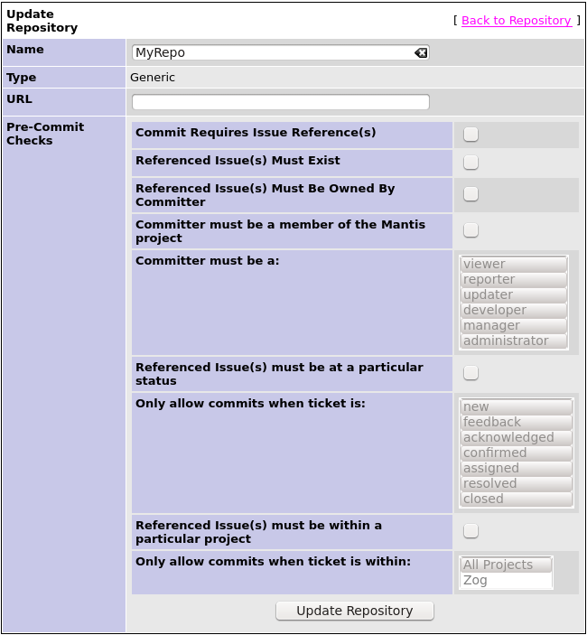

## Introduction

*What's the problem?*

I've got a Mantis project which I use to manage the development of my project/product.  When people commit to the version control repository they reference the Mantis issue number in the commits.
I want one or more of the following:

1. Ensure that commit comments do actually reference one or more issues.  I don't think that anyone should be making commits without referencing an issue.
1. I want to ensure that the issue(s) which are referenced in the commit comment are assigned to the person performing the commit
1. I want to ensure that the issue(s) which are referenced in the commit comment are at the confirmed or assigned state and haven't already been closed
1. I want to ensure that the issue(s) which are referenced in the commit comment belong to the appropriate project

*OK, what's your solution then?*

To build on the [Source
Integration](https://github.com/mantisbt-plugins/source-integration) plugin in
order to implement the checks and to utilise pre-commit hooks in order to make
the appropriate call-backs to Mantis.  If the checks performed by the hook don't
pass then the commit is prevented by the VCS

*I don't think that you should be so rule-happy with commit comments!*

It's a matter of choice - some projects prefer to have a greater degree of control/enforcement than others.  All of the checks are optional and none are enabled by default.

*I don't like your software - how else could I do this?*

I know of the following:

- [RepoGuard](http://repoguard.tigris.org/)

## How To Install

### Step 1 : Install the Mantis Plugin.

The code is a branch of the Source Integration plugin.  Go [here](https://github.com/bright-tools/source-integration) and click the "Download ZIP" link in order to get it.

Copy the contents of the zip file to the `plugins` directory in your Mantis install.

Follow steps 4-10 of the [Source Integration plugin installation guide](https://github.com/mantisbt-plugins/source-integration/blob/master/README.md) 

### Step 2 : Install the Hook

Several example hooks are provided - which one you need to use depends on which version control system you're using.

#### Subversion (SVN)

Copy the `SourceSVN/pre-commit.tmpl.mantis-checks-commit` file from the ZIP to your SVN repository's `hooks` directory.  Ensure that the file ownership is appropriate it has executable permission set.  More information on hooks can be found in the [Version Control with Subversion](http://svnbook.red-bean.com/en/1.7/svn-book.html#svn.reposadmin.create.hooks) book.

Rename the file within the `hooks` directory to be `pre-commit.tmpl` (i.e. remove the `.tmpl.mantis-checks-commit` extension)

Modify the `URL` setting to point to the web interface to your Mantis installation.  Don't remove the `plugin.php` part or the text which follows that.

Modify the `PROJECT` setting to match the name that you gave the repository when configuring it in Mantis (Part of Step 1).

Modify the `API_KEY` setting to match that which Mantis is configured to use (again, part of Step 1).

If necessary, update the `SVNLOOK` and `CURL` settings to point to where those tools are installed.

#### Git

TODO

### Step 3 : Configure the Mantis Plugin

All that's left to do now is to choose which checks you want to associate with
the repository.  For the purposes of this guide it is assumed that you already
have the basic repository details set up in Mantis as part of your
SourceIntegration configuration.  If not then you will need to perform this step
first.

In the Mantis web front-end, select the "Repositories" link, then click the
"Manage" link on the repository you wish to set up commit checking on.  Select
"Update Repository" and you will see a list of configuration options.  

Select those that you want (see the table below) and click "Update Repository"

| Option | Description |
|------------------------------------|--------------|
| Commit Required Issue Reference(s) | When enabled, this check will ensure that the commit comment contains references to one or more Mantis bug IDs.  The format of the reference is as per the SourceIntegration plugin's "Bug Link Regex" settings. |
| Referenced Issue(s) Must Exist | When enabled, this check will ensure that the Mantis bug IDs referenced in the commit comment are associated with tickets which exist in Mantis |
| Referenced Issue(s) Must Be Owned By Committer | When enabled, this check will cross-reference the user-name of the committer with the user-name to which the bug ID(s) referenced in the commit comment are assigned.  In the case that they don't all match, the check will fail |
| Committer must be a member of the Mantis project | When enabled, this check will cross-reference the user-name of the committer and the user-names associated with the Mantis project (see the project's configuration under "Manage Projects" in Mantis).  In the case that the committer is not listed as a project member, the check will fail |
| Committer Must Be A | In the case that the previous check is enabled, this field allows the check to be expanded to limit the access levels at which a commit is allowed.  By default, commit is allowed at all levels. |
| Referenced Issue(s) must be at a particular status | When enabled, this check examine the status of the bugs referenced in the commit comment.  In the case that one or more of the tickets is not one of the statuses listed in the "Only allow commit when ticket is" list, the check will fail |
| Only allow commit when ticket is | See previous item |
| Referenced Issue(s) must be within a particular project | When enabled, this check cross-references the Mantis projects to which referenced bugs belong and the list specified in the "Only allow commits when ticket is within" option.  In the case that one or more ticket is not a member of the specified list of Mantis projects, the check fails. |
| Only allow commits when ticket is within | See previous item |

### Step 4 : Quick Test (Optional)

A simple way to quickly test that your set-up is working is to enable the option to enforce issue references in commit comments, then to attempt to commit to the repository without referencing any issues.  The commit should be refused.  Of course in the case that the installation has not worked correctly, you will actually commit the file, so please be prepared for this!

## How to use

If the installation has been successful then all you need to do is ensure that
commit comments reference the appropriate tickets, using the appropriate format
of comments.  The format for referencing comments is configured as a regular
expression as part of the Source Integration plugin configuration.  By default
it recognises comments containing text such as `issue #12` or `issue #12,#61`, etc.

### Example

    bright-tools@ubuntu:~/repo$ svn commit -m "Issue #1,#8: Fix up the typos"
    Sending        example.txt
    Transmitting file data .svn: E165001: Commit failed (details follow):
    svn: E165001: Commit blocked by pre-commit hook (exit code 1) with output:
      % Total    % Received % Xferd  Average Speed   Time    Time     Time  Current
                                     Dload  Upload   Total   Spent    Left  Speed
    100   778  100   699  100    79  44573   5037 --:--:-- --:--:-- --:--:-- 46600
    Committing user does not have appropriate access level in project : Issue 1 (updater vs manager, administrator)
    Commit comment references non-existent issue : Issue 8
    bright-tools@ubuntu:~/repo$ 

## Potential Problems

*The user-names used for version control don't match those used in Mantis*

That's unfortunate and will require some manual intervention.  Possibly the easiest way to work around this is to create a look-up function to return the Mantis user-name based on the version control user name then modify the hook function to call this.

*I'm worried that information will 'leak' from the Mantis database - maybe someone could use this functionality to extract private information from Mantis?*

The Mantis installation and the VCS repository need to be set up to share a private key (as per SourceIntegration).  This means that someone without access to the API key will not be able to access the functionality used to check commit messages.
In the case that someone has access to the API (either by having access to the private key or by having commit access to an associated repository) then negative responses are intended to be informational in order to assist the user in understanding why the commit was refused.  This may mean that information relating to access levels or user names may be shown in the refusal message.  If this is a concern, changing the value of `$t_informational_errors` from `true` to `false` in `Source/pages/pre_commit_check.php` will restrict the information to a minimum.

## Testing

The code can be tested in an automated manner thanks to
[Vagrant](https://www.vagrantup.com/).  You need to have this installed in order
to run the tests

In order to set up the appropriate environment:

    bright-tools@ubuntu:~/source-integration$ cd testsupport
    bright-tools@ubuntu:~/source-integration/testsupport$ vagrant up

This should create a virtual machine and install the appropriate software
(including Mantis & importing the SourceIntegration code from your working area).

To run the tests:

    bright-tools@ubuntu:~/source-integration/testsupport$ vagrant ssh
    ...
    vagrant@vagrant-ubuntu-trusty-64:~$ /vagrant/run_tests.sh
